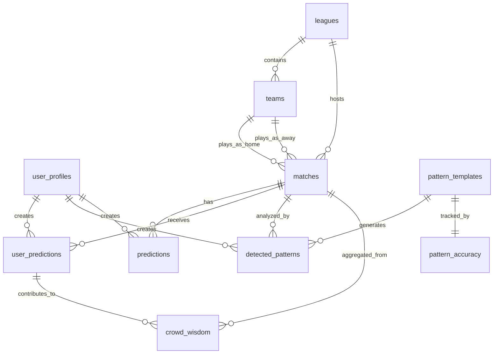

# WinMix TipsterHub - Comprehensive Database Migration

## 📋 Overview

This repository contains a comprehensive SQL migration script (`20260120000000_comprehensive_database_setup.sql`) that sets up the complete database infrastructure for the WinMix TipsterHub platform. This migration consolidates all database schema, role-based access control (RBAC), functions, triggers, row-level security (RLS) policies, and seed data into a single, production-ready script.

## 🚀 Quick Start

### Prerequisites
- PostgreSQL 14+ or Supabase
- Database administrator privileges
- Node.js 18+ (for validation scripts)

### Installation

1. **Backup Your Database (Important!)**
   ```bash
   pg_dump your_database > backup_before_migration.sql
   ```

2. **Apply the Migration**
   ```bash
   # Using psql
   psql your_database -f supabase/migrations/20260120000000_comprehensive_database_setup.sql
   
   # Using Supabase CLI
   supabase db push
   ```

3. **Validate the Migration**
   ```bash
   # Using SQL validation
   psql your_database -f scripts/validate-migration.sql
   
   # Using Node.js validation (requires environment variables)
   export SUPABASE_URL=your_supabase_url
   export SUPABASE_SERVICE_ROLE_KEY=your_service_key
   node scripts/validate-migration.js
   ```

## 📁 File Structure

```
├── supabase/migrations/
│   └── 20260120000000_comprehensive_database_setup.sql  # Main migration script
├── scripts/
│   ├── validate-migration.js                           # Node.js validation script
│   ├── validate-migration.sql                          # SQL validation script
│   └── seed-database.mjs                               # Additional seeding script
├── docs/database/
│   └── comprehensive_migration_guide.md                # Detailed documentation
└── COMPREHENSIVE_MIGRATION_README.md                   # This file
```

## 🏗️ What's Included

### 1. **Database Schema**
- **10 core tables** with proper relationships and constraints
- **UUID primary keys** for all tables
- **Comprehensive indexing** for optimal performance
- **Proper foreign key relationships** with cascade rules
- **Check constraints** for data integrity

### 2. **Role-Based Access Control (RBAC)**
- **6 hierarchical roles**: admin, analyst, predictor, team_manager, viewer, service
- **Custom database roles** with proper privilege assignment
- **Role hierarchy** with inheritance
- **Service role** for background operations

### 3. **Security Functions**
- **Authentication helpers** for user identification
- **Role checking functions** for access control
- **Data validation functions** for business logic
- **Utility functions** for common operations

### 4. **Triggers**
- **Automatic timestamp updates** for audit trails
- **Created by population** for data ownership
- **Pattern accuracy updates** for performance tracking
- **Crowd wisdom calculations** for real-time aggregation

### 5. **Row Level Security (RLS)**
- **Comprehensive policies** for all tables
- **User-based access control** for sensitive data
- **Public read access** for reference data
- **Admin full access** for management
- **Service role access** for system operations

### 6. **Views**
- **Upcoming matches with predictions** for easy querying
- **User prediction leaderboard** for gamification
- **Pattern performance summary** for analytics

### 7. **Seed Data**
- **7 major European leagues** (Premier League, La Liga, Serie A, Bundesliga, Ligue 1, Eredivisie, Primeira Liga)
- **80+ teams** with complete information
- **10 pattern templates** for prediction analysis
- **Sample matches** for demonstration

## 🔧 Key Features

### Security
- ✅ **Row Level Security** on all sensitive tables
- ✅ **Role-based access control** with hierarchical permissions
- ✅ **Service role isolation** for background tasks
- ✅ **Data validation** at database level
- ✅ **Audit trails** with automatic timestamps

### Performance
- ✅ **Optimized indexes** for common query patterns
- ✅ **Materialized views** for complex aggregations
- ✅ **Efficient triggers** for real-time updates
- ✅ **Proper foreign key relationships** with cascade rules

### Data Integrity
- ✅ **Check constraints** for data validation
- ✅ **Unique constraints** for preventing duplicates
- ✅ **Foreign key constraints** for referential integrity
- ✅ **Not null constraints** for required fields

### Scalability
- ✅ **UUID primary keys** for distributed systems
- ✅ **JSONB columns** for flexible data storage
- ✅ **Partition-friendly design** for large datasets
- ✅ **Efficient indexing strategy**

## 📊 Database Schema Overview



## 🛡️ Security Model

### User Roles and Permissions

| Role | Description | Permissions |
|------|-------------|-------------|
| **admin** | System administrator | Full access to all resources |
| **analyst** | Data analyst | Read analytics, write experiments |
| **predictor** | Prediction creator | Create/manage predictions |
| **team_manager** | Team data manager | Manage team-related data |
| **viewer** | Read-only user | Read public data only |
| **service** | Background service | System operations only |

### Access Control Examples

```sql
-- Users can only see their own profile
SELECT * FROM user_profiles WHERE id = auth.uid();

-- Admins can see all data
SELECT * FROM user_profiles WHERE is_admin();

-- Public can read active leagues
SELECT * FROM leagues WHERE is_active = true;

-- Service role can write predictions
INSERT INTO predictions (match_id, predicted_outcome, confidence_score)
VALUES (uuid, 'home_win', 75.5);
```

## 🔍 Validation

### Built-in Validation Scripts

1. **SQL Validation** (`scripts/validate-migration.sql`)
   - Checks table existence
   - Validates column structure
   - Tests RLS policies
   - Verifies functions and views
   - Checks seed data

2. **Node.js Validation** (`scripts/validate-migration.js`)
   - Full integration testing
   - API endpoint validation
   - Performance checks
   - Detailed error reporting

### Manual Validation Queries

```sql
-- Check all tables exist
SELECT table_name FROM information_schema.tables 
WHERE table_schema = 'public' ORDER BY table_name;

-- Verify RLS is enabled
SELECT tablename, rowsecurity FROM pg_tables 
WHERE schemaname = 'public';

-- Test security functions
SELECT is_admin(), is_analyst(), get_user_role();

-- Check seed data
SELECT COUNT(*) as leagues FROM leagues;
SELECT COUNT(*) as teams FROM teams;
SELECT COUNT(*) as patterns FROM pattern_templates;
```

## 🚨 Important Notes

### Before Migration
1. **ALWAYS backup your database** before running this migration
2. Test in a **development environment** first
3. Review the **migration script** to understand all changes
4. Plan for **downtime** during migration (usually 5-15 minutes)

### After Migration
1. **Run validation scripts** to verify everything works
2. **Update application code** to use new features
3. **Review security policies** with your team
4. **Monitor performance** after deployment
5. **Update documentation** for your team

### Known Limitations
1. **Large databases** may require extended migration time
2. **Custom modifications** to existing schema may cause conflicts
3. **Some existing data** may need manual migration
4. **Application compatibility** should be thoroughly tested

## 🔄 Maintenance

### Regular Tasks

1. **Weekly**: Monitor table sizes and index usage
2. **Monthly**: Review RLS policy performance
3. **Quarterly**: Update pattern accuracy statistics
4. **Annually**: Review and optimize schema

### Performance Monitoring

```sql
-- Check slow queries
SELECT query, mean_time, calls 
FROM pg_stat_statements 
ORDER BY mean_time DESC 
LIMIT 10;

-- Monitor index usage
SELECT schemaname, tablename, indexname, idx_scan, idx_tup_read
FROM pg_stat_user_indexes 
ORDER BY idx_scan DESC;

-- Check table sizes
SELECT schemaname, tablename, 
       pg_size_pretty(pg_total_relation_size(schemaname||'.'||tablename)) as size
FROM pg_tables 
WHERE schemaname = 'public'
ORDER BY pg_total_relation_size(schemaname||'.'||tablename) DESC;
```

## 🐛 Troubleshooting

### Common Issues

1. **Migration Fails with Permission Errors**
   ```bash
   # Ensure you have admin privileges
   psql -U postgres your_database
   ```

2. **RLS Policies Too Restrictive**
   ```sql
   -- Check which policies are blocking access
   EXPLAIN (VERBOSE, FORMAT JSON) 
   SELECT * FROM sensitive_table;
   ```

3. **Performance Issues After Migration**
   ```sql
   -- Check if indexes are being used
   EXPLAIN ANALYZE 
   SELECT * FROM matches WHERE match_date > NOW();
   ```

4. **Seed Data Missing**
   ```sql
   -- Manually run seed data section
   -- See lines 850-950 in migration script
   ```

### Getting Help

1. **Check the documentation**: `docs/database/comprehensive_migration_guide.md`
2. **Run validation scripts**: `scripts/validate-migration.sql`
3. **Review migration logs**: Check PostgreSQL logs for errors
4. **Test with small dataset**: Validate with minimal data first

## 📈 Future Enhancements

### Planned Improvements
1. **Multi-sport support** (basketball, tennis, etc.)
2. **Advanced analytics** with machine learning integration
3. **Real-time predictions** with WebSocket support
4. **Mobile app API** optimization
5. **Advanced caching** with Redis integration
6. **Data archiving** for historical data management

### Extension Points
1. **Custom pattern detection** algorithms
2. **External API integrations** for live data
3. **Social features** for user interaction
4. **Betting integration** with external bookmakers
5. **Advanced reporting** with BI tools

## 📄 License

This migration is part of the WinMix TipsterHub project. Please refer to the main project license for usage terms.

## 🤝 Contributing

When contributing to the database schema:

1. **Always test migrations** in development first
2. **Update documentation** for any schema changes
3. **Add validation tests** for new features
4. **Follow naming conventions** established in the migration
5. **Consider performance implications** of changes
6. **Update this README** with any breaking changes

## 📞 Support

For questions or issues related to this migration:

1. **Check the validation script output** first
2. **Review the comprehensive documentation**
3. **Test with a minimal dataset**
4. **Create an issue** with detailed error messages
5. **Include migration logs** and validation results

---

**Migration Version**: 20260120000000  
**Last Updated**: 2024-01-20  
**Compatible With**: PostgreSQL 14+, Supabase  
**Estimated Runtime**: 5-15 minutes (depending on data size)